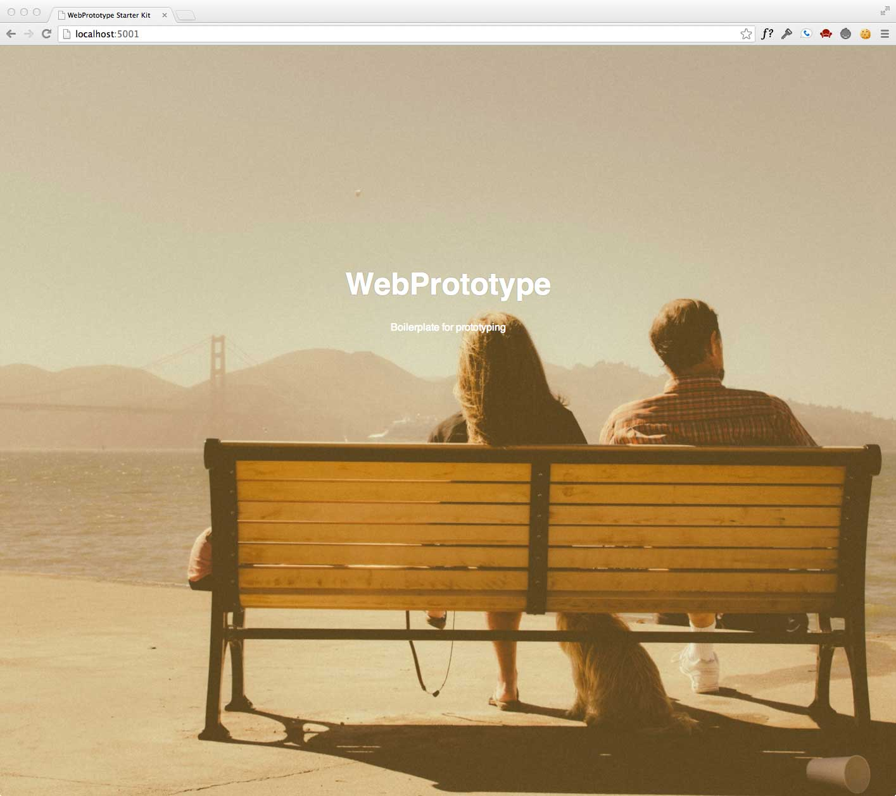

# WebPrototype

Node.js/Express website that is used for prototyping websites.  Use this web application to convert your mockups into live code.

Includes:

- Grunt.js: Task runner for performing repetitive tasks like minification, compilation, unit testing, linting, etc.  
- SASS: Pre-processing stylesheets that allows variables, mixins, inheritance with CSS.
- Normalize-css: CSS file that makes browsers render all elements more consistently and in line with modern standards.
- Prefix-free: Break free from CSS prefix hell by Lea Verou.
- Express.js: Node.js web application framework.
- Underscore.js: Utility-belt library for JavaScript.
- jQuery: Abstraction layer and toolkit for working with the DOM.
- EJS: Templating markup tool.

## How to run this Prototype Tool

1. download/install [node.js](http://nodejs.org)
1. download/install [git](http://git-scm.com/)
1. clone this repo with git: `git clone https://github.com/slhernandez/WebPrototype.git`
1. go into the directory that was created by git: `cd WebPrototype`
1. install dependencies with npm: `npm i`
1. run it: `node server`
1. open http://localhost:3000 in a browser

